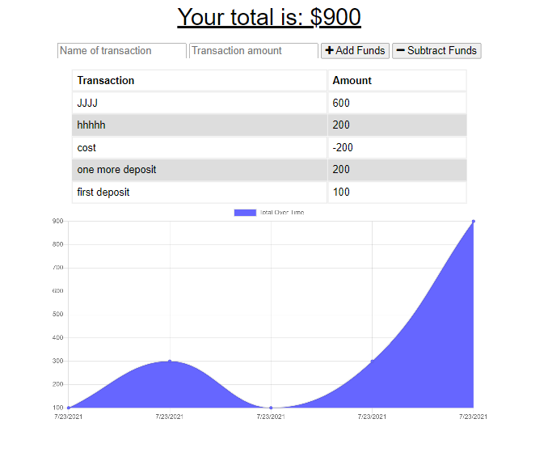

# Budget Tracker
   

# Description

This is an app that helps its user to manage expenses.

# Table of Contents  

  * [Installation](#installation)
  * [Usage](#usage)
  * [License](#license)
   
  
# Installation
    
  This is an app that was converted to a PWA, you can install it in your device by visiting its deployment webpage on [Budget Tracker](http://gentle-coast-06047.herokuapp.com/) and clicking on the icon in the left side of the star in your browser bar.

# Usage
    
  In this app you can manage your money by registrating your expenses and savings. Once you do a transaction, you just fill the form fields with a desciption and the value, after that you click on the + (plus sign) to register a deposit or in the - (minus sign) to register a expense.

# License
  

  Copyright (c) 2021 Virginia Rabello.
  Licensed under the [GPL-2.0](https://opensource.org/licenses/GPL-2.0) license.